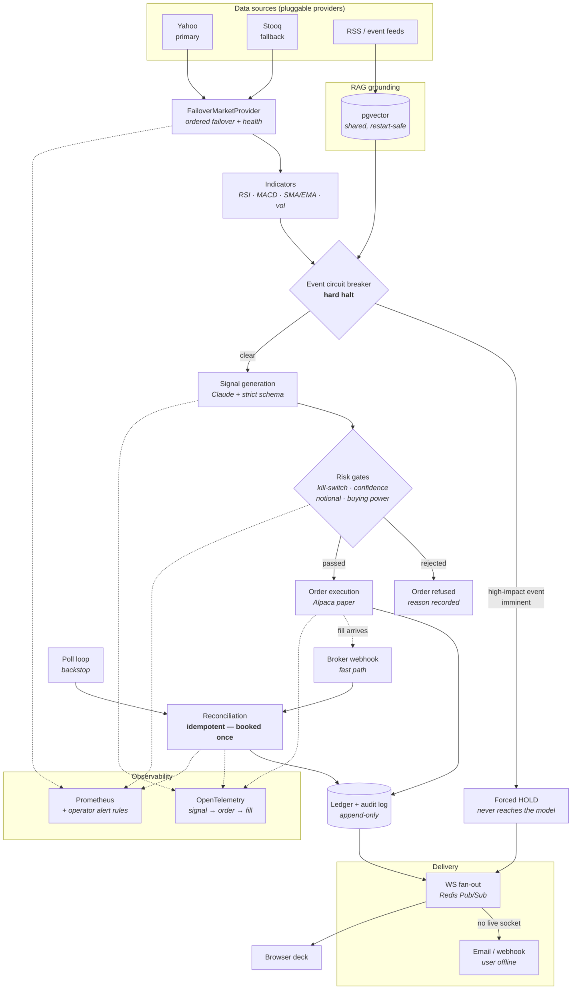

# AI Finance Intelligence

Market-intelligence and paper-trading execution platform. FastAPI + Claude, with a
quantitative core that keeps working when the model does not.


> **Not investment advice.** Every output is a research signal. Market data is
> delayed, broker integration is paper-trading by default, and no output should be
> treated as a recommendation to buy or sell.

---

## Contents

- [What it does](#what-it-does)
- [Architecture](#architecture)
- [Quickstart](#quickstart)
- [Configuration](#configuration)
- [API](#api)
- [Testing](#testing)
- [Observability](#observability)
- [Deployment](#deployment)
- [Project layout](#project-layout)

---

## What it does

**Market intelligence**
- Price, technical indicators (RSI, MACD, SMA/EMA, annualized volatility) and
  fundamentals, served without an AI call in the hot path.
- RAG-grounded Claude signals (BUY/SELL/HOLD with confidence and citations),
  validated against a strict schema — malformed model output is rejected, not
  parsed loosely.
- Event intelligence: macro, legal and social feeds scored for impact.

**Execution**
- Paper-first broker integration (Alpaca) with encrypted-at-rest credentials.
- Fail-closed risk gates before every order: kill-switch, confidence floor, max
  notional, live buying power.
- Append-only ledger with a `TradeAuditLog`, plus broker/ledger position drift
  detection.
- Fills arrive event-driven over a webhook, with a polling loop retained as an
  idempotent backstop.

**Portfolio & research**
- Holdings reconstructed from transactions, realized/unrealized P&L, weights.
- Risk analytics (VaR, max drawdown, correlation), portfolio optimization and
  strategy backtesting.

**Realtime**
- WebSocket streaming of model output, alerts and market-wide events, fanned out
  across workers via Redis Pub/Sub.
- Out-of-band alert fallback (email/webhook) when no socket is reachable.

### Degraded-first design

Nothing hard-depends on an external service being up:

| Missing | Behaviour |
|---|---|
| `ANTHROPIC_API_KEY` | Quant readings still returned; responses flagged `degraded: true` |
| Redis | Falls back to per-process cache, local-only WS delivery |
| Postgres | Falls back to SQLite; RAG falls back to the in-memory vector store |
| Primary market provider | Fails over to the secondary source automatically |
| OTel collector | Spans are dropped; context propagation still works |

---

## Architecture



### The path in words

1. **Market data** is read through `FailoverMarketProvider` — Yahoo first, Stooq
   on failure — so a single upstream outage cannot freeze signal generation.
   News and event feeds are embedded into **pgvector**, shared across workers and
   surviving restarts.
2. **Indicators** are computed with no AI in the path, so `/api/market/{symbol}`
   answers instantly.
3. **The circuit breaker runs before the model, not after it.** A high-impact
   imminent event forces `HOLD` without an AI call at all — enforcement must not
   depend on the model choosing to comply.
4. **Risk gates** are fail-closed. Each rejection carries a structural `reason`
   that feeds the operator metrics.
5. **Execution** places a paper order and writes an append-only audit record.
6. **Reconciliation** books the fill exactly once, whether it arrives via the
   webhook fast path or the polling backstop.
7. **Observability** traces the whole chain as one trace, and **delivery** fans
   alerts out across workers — escalating to email/webhook when nobody is
   connected.

---

## Quickstart

### Docker (recommended — production-shaped)

Runs the same topology as production: Postgres + pgvector, Redis, and a
multi-worker API. Several behaviours (leader-locked scheduler, cross-worker WS
fan-out, shared RAG index) only exist with this stack.

```bash
git clone <repo-url> && cd "AI Finance Intelligence"
cp .env.example .env          # optional: add ANTHROPIC_API_KEY
docker compose up --build
```

- Deck: <http://localhost:8000>
- API docs: <http://localhost:8000/docs>
- Health: <http://localhost:8000/health> · readiness <http://localhost:8000/health/ready>
- Metrics: <http://localhost:8000/metrics>

```bash
docker compose down -v        # stop and drop volumes
```

### Local Python (fastest iteration)

Uses SQLite and an in-memory cache — fine for development, not representative of
multi-worker behaviour.

```bash
python -m venv .venv && source .venv/bin/activate
pip install -r requirements.txt
cp .env.example .env
alembic upgrade head
python run.py
```

---

## Configuration

All settings are environment variables (see `.env.example`). Only the ones you
need are required — everything else has a safe default.

### Core

| Variable | Default | Purpose |
|---|---|---|
| `ENVIRONMENT` | `development` | `production` enables the fail-closed boot preflight |
| `DATABASE_URL` | `sqlite:///./finance.db` | Postgres enables pgvector RAG |
| `HOST` / `PORT` | `127.0.0.1` / `8000` | Bind address |
| `WEB_CONCURRENCY` | `4` (Docker) | Uvicorn worker count |

### AI

| Variable | Default | Purpose |
|---|---|---|
| `ANTHROPIC_API_KEY` | _empty_ | Empty ⇒ degraded mode (quant only) |
| `AI_MODEL` | `claude-sonnet-4-6` | Model id |
| `AI_MAX_TOKENS` | `1024` | Response cap |
| `RATE_LIMIT_AI` | `5/minute` | Per-user limit on AI endpoints |

### Cache & realtime

| Variable | Default | Purpose |
|---|---|---|
| `CACHE_BACKEND` | `memory` | **Must be `redis` in production** (multi-worker safety) |
| `REDIS_URL` | `redis://localhost:6379/0` | Cache, WS fan-out, scheduler leader lock |
| `CACHE_TTL_SECONDS` | `120` | Quote/news cache TTL |

### Auth & encryption

| Variable | Default | Purpose |
|---|---|---|
| `JWT_SECRET` | dev placeholder | **≥32 bytes in production**; boot refuses a placeholder |
| `ACCESS_TOKEN_EXPIRE_MINUTES` | `15` | Access token lifetime |
| `REFRESH_TOKEN_EXPIRE_DAYS` | `7` | Refresh token lifetime |
| `ENCRYPTION_KEY` | _empty_ | **Required in production.** Fernet key(s) encrypting broker credentials. Comma-separated for rotation, primary first |

Generate: `python -c "from cryptography.fernet import Fernet; print(Fernet.generate_key().decode())"`

### Trading & execution

| Variable | Default | Purpose |
|---|---|---|
| `TRADE_ENABLED` | `true` | Master switch |
| `ALPACA_BASE_URL` | paper endpoint | Broker base URL |
| `MAX_ORDER_NOTIONAL` | `10000` | Hard per-order cap |
| `MIN_TRADE_CONFIDENCE` | `0.0` | `>0` requires signal confidence |
| `TRADE_WEBHOOK_SECRET` | _empty_ | Shared secret for `/api/trade/webhook`. **Empty ⇒ endpoint disabled (503)** |
| `ORDER_POLL_INTERVAL_SECONDS` | `30` | Reconciliation backstop cadence |
| `RISK_SWEEP_ENABLED` | `true` | Evaluates the daily-loss limit on a timer. Off ⇒ the automatic halt only trips when a request happens to hit the check |
| `RISK_SWEEP_INTERVAL_MINUTES` | `5` | Sweep cadence |

Generate: `python -c "import secrets; print(secrets.token_urlsafe(32))"`

### Alert fallback (user offline)

| Variable | Default | Purpose |
|---|---|---|
| `NOTIFY_WEBHOOK_URL` | _empty_ | Generic POST sink (Slack, ops) |
| `NOTIFY_EMAIL_ENABLED` | `false` | Enable SMTP sink |
| `SMTP_HOST` / `SMTP_PORT` | _empty_ / `587` | SMTP server |
| `SMTP_USERNAME` / `SMTP_PASSWORD` | _empty_ | Credentials (omit for anonymous relay) |
| `SMTP_USE_TLS` | `true` | STARTTLS |

### Tracing

| Variable | Default | Purpose |
|---|---|---|
| `OTEL_ENABLED` | `false` | Enable OpenTelemetry |
| `OTEL_SERVICE_NAME` | `ai-finance-intelligence` | Resource name |
| `OTEL_EXPORTER_OTLP_ENDPOINT` | _empty_ | Empty ⇒ spans created and dropped |

### Production preflight

With `ENVIRONMENT=production` the app **refuses to boot** on: a missing or
placeholder `JWT_SECRET`, a secret under 32 bytes, a missing `ANTHROPIC_API_KEY`,
`CACHE_BACKEND=memory`, or a missing/invalid `ENCRYPTION_KEY`. Misconfiguration
fails at startup, not at the first request.

---

## API

Interactive docs at `/docs`. The full machine-readable contract is committed at
[`docs/openapi.json`](docs/openapi.json) / [`docs/openapi.yaml`](docs/openapi.yaml)
and CI fails if it drifts from the code.

```bash
python scripts/export_openapi.py          # regenerate
python scripts/export_openapi.py --check  # verify it is current
```

| Method | Path | Auth | Description |
|---|---|:--:|---|
| `POST` | `/api/auth/register` | — | Create an account |
| `POST` | `/api/auth/login` | — | Issue access + refresh tokens |
| `POST` | `/api/auth/refresh` | — | Rotate tokens |
| `POST` | `/api/auth/logout` | ✓ | Revoke a refresh token |
| `GET` | `/api/market/{symbol}` | — | Price, indicators, fundamentals (no AI) |
| `GET` | `/api/market/{symbol}/ai-insights` | — | RAG-grounded BUY/SELL/HOLD signal |
| `GET` | `/api/news` | — | Financial news |
| `GET` | `/api/news/ai-insights` | — | Summary + sentiment |
| `GET` | `/api/events` | — | Scored macro/legal/social events |
| `GET` | `/api/portfolio` | ✓ | Holdings from the ledger |
| `GET`/`POST` | `/api/portfolio/transactions` | ✓ | Read / record trades |
| `GET` | `/api/portfolio/risk` | ✓ | Risk report |
| `GET` | `/api/portfolio/risk/ai-insights` | ✓ | Narrative risk advice |
| `GET` | `/api/portfolio/optimize` | ✓ | Portfolio optimization |
| `GET` | `/api/portfolio/correlation` | ✓ | Correlation matrix |
| `GET` | `/api/portfolio/performance` | ✓ | Equity curve, return, max drawdown |
| `POST` | `/api/backtest/run` | ✓ | Run a strategy backtest (saved to history) |
| `GET` | `/api/backtest/runs` | ✓ | Saved runs, newest first (`X-Total-Count`) |
| `GET` | `/api/backtest/runs/compare?ids=` | ✓ | Runs side by side + leader per metric |
| `GET`/`DELETE` | `/api/backtest/runs/{id}` | ✓ | Fetch one run in full / delete it |
| `GET`/`POST` | `/api/trade/credentials` | ✓ | Broker keys (encrypted at rest) |
| `POST` | `/api/trade/execute` | ✓ | Risk-checked paper order |
| `GET` | `/api/trade/orders` | ✓ | Submitted orders + reconciliation state |
| `GET` | `/api/trade/orders/{id}` | ✓ | One order and its reconciliation state |
| `PATCH` | `/api/trade/orders/{id}` | ✓ | Amend size / limit price — **returns the replacement order, with a new id** |
| `DELETE` | `/api/trade/orders/{id}` | ✓ | Cancel a working order (→ `pending_cancel`) |
| `GET` | `/api/trade/deck` | ✓ | Combined desk state |
| `GET`/`POST` | `/api/trade/kill-switch` | ✓ | Read / toggle the halt (flattens working orders) |
| `GET`/`POST` | `/api/trade/risk-config` | ✓ | Per-user risk limits |
| `GET` | `/api/trade/reconciliation` | ✓ | Broker vs ledger drift |
| `GET` | `/api/trade/audit` | ✓ | Append-only compliance trail |
| `GET` | `/api/trade/signal-scorecard` | ✓ | Live signal hit rate + calibration |
| `POST` | `/api/trade/webhook` | secret | Alpaca trade-update ingestion |
| `GET`/`POST`/`DELETE` | `/api/alerts` | ✓ | Manage alerts |
| `GET` | `/health` · `/health/live` | — | Liveness — never touches a dependency |
| `GET` | `/health/ready` | — | Readiness — 503 when Postgres is unreachable |
| `GET` | `/metrics` | — | Prometheus |

### WebSocket

Both channels authenticate with `?token=<access_token>` and close `1008` without
a valid one.

```
ws://host/ws/insights/{symbol}?token=<access_token>
```

Frames: `start`, `token` (incremental text), `end` (citations + disclaimer),
`error`, `alert` (a user alert fired), `event` (market-wide broadcast).

```
ws://host/ws/account?token=<access_token>
```

Push-only account stream, opening with `ready`. Frames: `order` (a state change
at the venue — a fill or a rejection surfaces the moment reconciliation observes
it, not on the next poll), `halt` (trading stopped for this account: `reason` is
`manual` or `daily_loss_limit`, `canceled_orders` reports what was flattened),
plus `alert` and `event`. The socket carries no request protocol — anything the
client sends is ignored, so it can never become a second, unaudited command
surface.

---

## Testing

```bash
pytest -q                                          # 649 tests
pytest --cov=app --cov-report=term-missing         # with coverage
pytest --cov=app --cov-branch --cov-fail-under=89  # the CI gate
```

Unit and integration tests mock every provider and the model — **no network
access** — so the suite is deterministic and offline.

### End-to-end against a live container

```bash
docker compose up -d --build
python scripts/e2e_smoke.py --base-url http://localhost:8000
```

This drives the real image over HTTP and WebSocket against real Postgres and
Redis: auth flow, ledger round-trip, kill-switch refusal, alert CRUD, metrics
exposure and fail-closed defaults. Provider-dependent checks are probed and
reported, never asserted, so it cannot flake on network conditions.

### CI

| Job | Gate |
|---|---|
| **Test + Coverage** | Migrations apply; full suite; fails under 87% coverage |
| **API Contract** | Committed OpenAPI spec matches the app |
| **Security** | Bandit (medium+) and `pip-audit` both clean |
| **Docker + E2E** | Production image builds; smoke suite passes against the live stack; container logs clean |

---

## Observability

**Traces.** With `OTEL_ENABLED=true`, one trace spans
`signal.generate → order.execute → fill.reconcile`, carrying symbol, side,
notional and order id. Inbound FastAPI requests and outbound httpx calls are
auto-instrumented.

**Metrics** at `/metrics`:

| Metric | Meaning |
|---|---|
| `trade_orders_total{outcome,reason}` | Accepts vs rejects, by structural reason |
| `trade_fills_reconciled_total{source}` | `webhook` fast path vs `poll` backstop |
| `market_provider_failovers_total{provider}` | Upstream degradation |
| `ws_disconnects_total{reason}` | `client` vs `error` disconnects |
| `alert_fallback_deliveries_total{result}` | Out-of-band escalations |
| `ai_circuit_breaker_trips_total` | Model circuit breaker opening |
| `cache_events_total{backend,result}` | Cache hit/miss |

**Alerting.** [`config/prometheus/alerts.yml`](config/prometheus/alerts.yml)
ships 13 operator rules. Two worth calling out:

- The order-reject rule **excludes** risk-limit rejections, so users hitting
  their own limits does not page you for broken execution.
- `WebhookFillIngestionStalled` fires when fills arrive *only* via the poll
  backstop — webhook ingestion breaking otherwise looks perfectly healthy.

```yaml
# prometheus.yml
rule_files:
  - /etc/prometheus/rules/alerts.yml
scrape_configs:
  - job_name: ai-finance
    static_configs:
      - targets: ["api:8000"]
```

---

## Deployment

**Render** — [`render.yaml`](render.yaml) is a complete blueprint: managed
Postgres 16 + Redis, Docker runtime, `/health/ready` check, `alembic upgrade head`
as a pre-deploy step, generated `JWT_SECRET`, and secrets left unsynced.

**Point your orchestrator at the right probe.** They answer different questions:

| Probe | Question | Wire it to |
|---|---|---|
| `/health`, `/health/live` | Is the process alive? | Restart policy |
| `/health/ready` | Should this instance get traffic? | Load balancer, rolling deploys |

Readiness returns **503** when Postgres is unreachable, and reports Redis as
`degraded` while still serving — every consumer of Redis here falls back, and
since all instances share one Redis, failing readiness on it would pull the
whole fleet and turn a degraded service into an outage. Never wire a dependency
into liveness: no restart fixes a database outage, and doing so converts a
backend blip into a crash-loop of healthy containers.

Enable pgvector once on the database:

```sql
CREATE EXTENSION IF NOT EXISTS vector;
```

**Anywhere else** — the image is standard: multi-stage, non-root (uid 10001), no
build toolchain in the runtime layer, `$PORT`/`$WEB_CONCURRENCY` driven.

```bash
docker build -t ai-finance-intelligence .
docker run -p 8000:8000 --env-file .env ai-finance-intelligence
```

---

## Project layout

```
app/
  api/routes/     FastAPI routers (market, news, portfolio, trade, alerts, events…)
  api/websockets  WS endpoint + cross-worker connection manager
  core/           config, DI, cache, auth, crypto, metrics, tracing, locks,
                  vector stores, WS broadcaster, notifications
  models/         Pydantic + SQLModel schemas (strict at every boundary)
  providers/      Pluggable upstreams: Yahoo, Stooq, failover, RSS, Alpaca
  services/       Business logic: indicators, ai, market, news, portfolio,
                  quant, backtest, trade, risk, reconciliation, events
config/prometheus/ Operator alert rules
docs/             Generated OpenAPI contract
migrations/       Alembic revisions
scripts/          OpenAPI export, E2E smoke suite
tests/            649 Python + 45 JS tests, offline and deterministic
web/              Browser deck (vanilla JS, no build step)
```

**Adding a data source** is one file: implement the `MarketDataProvider`
protocol and register it in the failover chain in `app/core/deps.py`. No service
or route changes.

---

## License

See repository settings. Outputs are research signals, not investment advice.
